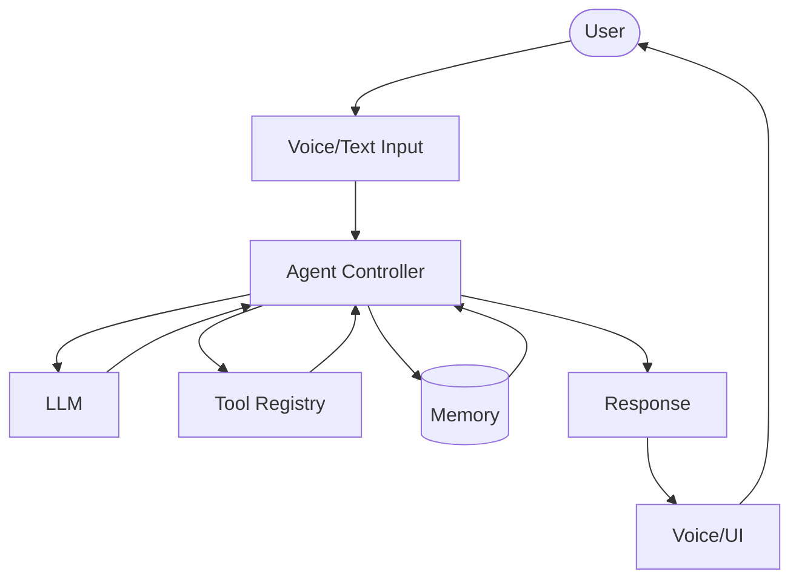

# System Architecture

The Jarvis AI Assistant follows a modular layered architecture. This design ensures separation of concerns, high maintainability, and ease of testing by decoupling the user interface, agent loop, LLM integrations, and core utilities.

## System Layers

### 1. Presentation Layer
Responsible for interacting with the user and handling I/O:
- **Desktop UI**: The graphical user interface for user interaction.
- **Voice Input**: Capturing and processing user audio streams.
- **Voice Output**: Text-to-speech synthesis to respond to the user.
- **Notifications**: System-level notifications and alerts.

### 2. Application Layer
Handles core business logic and system flow:
- **Agent Loop**: The main execution loop processing inputs and driving agent actions.
- **Conversation Flow**: Managing state machine for interaction turns.
- **Orchestration**: Coordinating actions between UI, memory, tools, and LLM services.

### 3. AI Layer
Manages interactions with artificial intelligence models:
- **Prompt Construction**: Building context-rich prompt templates.
- **LLM Communication**: Sending requests to local or remote Large Language Models.
- **Tool Calling**: Parsing model responses to identify tool usage intents.

### 4. Tool Layer
Provides capabilities and actions the agent can perform:
- **Registered Tools**: Defined system capabilities (e.g., file read/write, search).
- **Safe Execution**: Sandboxing and running tools securely.
- **Validation**: Verifying arguments and bounds before execution.

### 5. Memory Layer
Manages persistence of conversational and agent state:
- **Conversation Memory**: Short-term chat history.
- **Task Memory**: Long-term objective tracking and state.
- **SQLite**: Local relational database backend for structured storage.

### 6. Infrastructure Layer
Provides supporting services for the application:
- **Logging**: System-wide diagnostic logs.
- **Configuration**: Handling app settings, API keys, and environment variables.
- **Utilities**: General helper functions and common code.

## Flowchart

