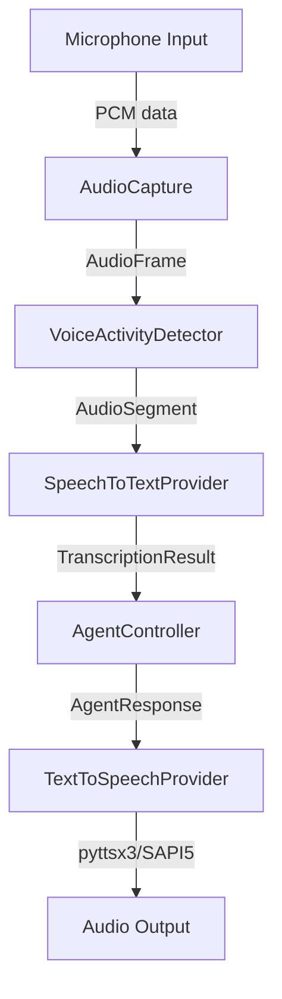
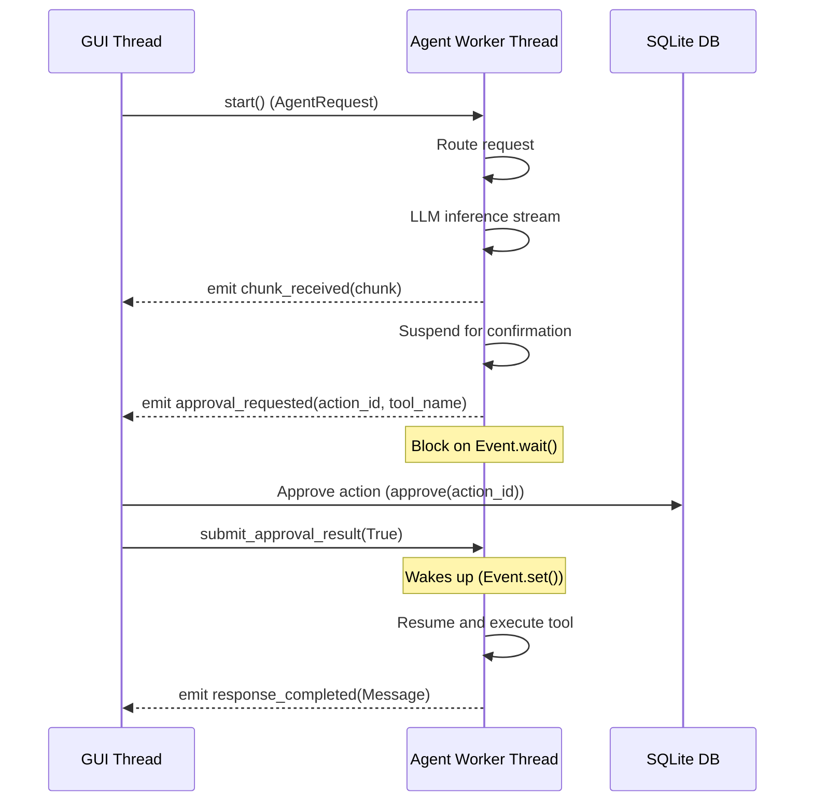

# Jarvis AI Assistant Architecture

This document details the software architecture of the Jarvis AI Assistant, a production-oriented, local AI desktop helper.

---

## 1. Purpose

The architecture of Jarvis is designed to be highly modular to ensure clean separation of concerns, facilitate unit testing of subsystems, and decouple local model runtimes from high-level agent logic. By enforcing strict boundaries, the system is designed to support the implementation of future interfaces, tool runtimes, and local audio capture without requiring core orchestrator changes.

---

## 2. Architectural Principles

- **Separation of Concerns**: User interaction, planning logic, inference backends, and infrastructure settings occupy dedicated modules with limited, well-defined communication channels.
- **Dependency Abstraction**: High-level components communicate with models through interfaces (e.g. `BaseLLMProvider`), preventing codebases from coupling to specific provider APIs.
- **Provider Isolation**: All vendor-specific communication logic is encapsulated within concrete provider modules (e.g. `OllamaProvider`), hiding implementation details from the rest of the application.
- **Lifecycle Management**: The application state is represented as an explicit state machine, ensuring predictable setups, execution loops, and resource release.
- **Configuration Externalization**: Application defaults and settings are declared in central configurations (`constants.py` and `settings.py`) and loaded via type-safe environments.
- **Explicit Planning and Execution Boundaries**: Task routing decisions are decoupled into an explicit classification stage (`Planner`) and execution stage (`Executor`), laying the foundation for future tool usage routing.

---

## 3. High-Level Architecture

The diagram below maps the runtime components and wiring in the current codebase:

```
[ Entry Point (main.py) ]
          │
          ▼
   [ Application ] ──────(Setup)──────► [ Bootstrap ] ──► [ DirectoryManager ]
          │                                   │
          │ (Registers)                       ▼
          ├──────────────────────────► [ JarvisLogger ] (daily rotating file)
          │
          ▼ (Initializes & owns)
  [ ServiceContainer ]
          │
          ▼ (Holds singletons)
          ├─ Settings
          ├─ JarvisLogger
          ├─ LLMManager
          └─ AgentController ──► [ ContextManager ] (active request tracker)
                    │
                    ▼
             [ Conversation ] (in-memory message log list)
                    │
                    ▼ (Uses)
              [ Planner ] ──► [ ExecutionPlan ] (Intent: CHAT)
                    │
                    ▼ (Uses)
              [ Executor ] ──(Generates format payload)──► [ MessageFormatter ]
                    │
                    ▼
              [ LLMManager ] ──► [ BaseLLMProvider ] (Interface)
                                          ▲
                                          │ (Implements)
                                  [ OllamaProvider ] ──► [ Local Ollama Server ]
                                          │
                                          ▼ (Returns ChatResponse/dict)
                                  [ ResponseParser ]
                                          │
                                          ▼
                                   [ AgentResponse ]
```

---

## 4. Core Infrastructure

- **`Application`**: Located in `app/core/application.py`. Serves as the primary system orchestrator. It manages the dependency registration, setups the runtime state, and drives the interactive terminal input loop.
- **`Bootstrap`**: Located in `app/core/bootstrap.py`. Coordinates environment verification during startup, validating directory existences and activating standard logs.
- **`DirectoryManager`**: Located in `app/core/bootstrap.py`. Creates and verifies required runtime directories (`DATA_DIR`, `LOG_DIR`, `CONFIG_DIR`) as defined by system paths.
- **`ApplicationState`**: Located in `app/core/lifecycle.py`. Represents the active state machine of the runtime process (`STARTING`, `INITIALIZING`, `RUNNING`, `STOPPING`, `STOPPED`, `ERROR`).
- **`ServiceContainer`**: Located in `app/core/container.py`. A lightweight service-locator container storing active singletons (e.g. `Settings`, `JarvisLogger`, `LLMManager`) to prevent tight coupling.
- **`Settings`**: Located in `app/config/settings.py`. Type-safe configuration loader using `pydantic-settings` to load, map, and validate variables from the environment.
- **`JarvisLogger`**: Located in `app/core/logger.py`. Encapsulates `loguru` setup logic, exposing consistent level methods (`info`, `warning`, `error`, etc.) and establishing console/rotating file loggers.

---

## 5. Agent Engine

- **`AgentController`**: Located in `app/agent/controller.py`. Serves as the gateway for request processing. It records prompts, triggers planners, executes workflows, normalizes outputs, and completes dialogue logs.
- **`Conversation`**: Located in `app/agent/conversation.py`. Manages the session-specific ordered history list of message objects. It is strictly in-memory and holds no database configurations.
- **`ContextManager`**: Located in `app/agent/context.py`. Maintains short-lived state variables of the active user session, such as active topics and current `AgentRequest` tracking.
- **`Intent` & `IntentType`**: Located in `app/agent/intent.py`. Data structures describing classified user requests. The `IntentType` enum defines categories such as `CHAT`, `TOOL`, `MEMORY_READ`, `MEMORY_WRITE`, `SYSTEM`, and `UNKNOWN`.
- **`Planner`**: Located in `app/agent/planner.py`. Evaluates incoming prompts to generate an `ExecutionPlan`. Currently, the `Planner` uses a hardcoded rule that always outputs a `CHAT` intent requiring LLM generation. No AI-based classification is currently implemented.
- **`ExecutionPlan`**: Located in `app/agent/planner.py`. An immutable dataclass indicating whether the execution loop must call the LLM (`use_llm=True`), call system tools (`use_tools=False`), or write/retrieve database memories (`use_memory=False`).
- **`Executor`**: Located in `app/agent/executor.py`. Handles routing of plans. If `use_llm` is enabled, it dispatches message payloads to `LLMManager` and returns the raw model completions. It raises a `NotImplementedError` for tool or memory executions.

---

## 6. AI Layer

- **`BaseLLMProvider`**: Located in `app/ai/interfaces.py`. Abstract base class defining model client interactions (`initialize`, `shutdown`, `generate`, `health_check`).
- **`LLMManager`**: Located in `app/ai/manager.py`. Manages available model providers, registers backends, loads model dependencies, and routes generation prompts to active provider instances.
- **`MessageFormatter`**: Located in `app/ai/formatter.py`. Standardizes internal message models into dictionaries containing role and text payloads expected by LLM APIs.
- **`ResponseParser`**: Located in `app/ai/parser.py`. Normalizes raw response payloads returned by LLM APIs (supporting both dictionary logs and SDK `ChatResponse` objects) into standard `AgentResponse` blocks.
- **`PromptManager`**: Located in `app/ai/prompts.py`. Exposes placeholder system, safety, and developer instructions.
- **`OllamaProvider`**: Located in `app/ai/providers/ollama.py`. Implements `BaseLLMProvider` using the official `ollama` SDK. It coordinates server connections, lists installed models to verify model availability, and executes chat queries.

---

## 7. Memory Subsystem

The memory subsystem provides a persistent storage foundation for long-term user facts, projects, preferences, and assistant context. It is designed to be completely provider-neutral, isolating SQLite database mechanics behind clear domain interfaces.

- **`Memory`**: Located in `app/memory/models.py`. An immutable domain model representing a single durable item of memory. It contains attributes like `memory_id`, `content`, `memory_type` (e.g. `FACT`, `PREFERENCE`, `PROJECT`, `CONTEXT`), `created_at`, `updated_at`, `importance` (score between 0.0 and 1.0), `source` (e.g. `USER`, `SYSTEM`, `MANUAL`), and extensible JSON metadata.
- **`MemoryRepository`**: Located in `app/memory/interfaces.py`. Abstract base repository contract defining persistence operations (`add`, `get`, `list_all`, `update`, `delete`, `count`).
- **`SQLiteMemoryRepository`**: Located in `app/memory/repository.py`. SQLite-backed database engine implementation mapping memory models to sql tables. It encapsulates table initialization (`memories`), parameterized inserts/updates/deletes, schema-level validations, and JSON metadata parsing.
- **`MemoryManager`**: Located in `app/memory/manager.py`. Domain coordinator executing validations and managing memories. It generates unique memory IDs using centralized ID utilities and timestamps using timezone-aware UTC datetime. `MemoryManager` has no direct knowledge of SQLite database schemas, and receives repositories via constructor injection.
- **`LexicalMemoryRetriever`**: Located in `app/memory/retrieval.py`. Performs lexical matching against stored memories using token-based overlap and importance score ranking.
- **`MemoryContextBuilder`**: Located in `app/memory/context.py`. Formats matched memories into a structured markdown block (`[RELEVANT LONG-TERM MEMORY]`) to inject into the system prompt.
- **`LLMMemoryExtractor`**: Located in `app/memory/extraction.py`. Uses the LLM under a dedicated low-temperature deterministic profile (`MEMORY_EXTRACTION`) to parse user request text for durable user facts or preferences.
- **`MemoryExtractionParser`**: Located in `app/memory/parser.py`. Robustly parses LLM response text into structured `MemoryCandidate` lists (now containing exact supporting verbatim evidence strings), isolating malformed JSON items.
- **`MemoryEvidenceValidator`**: Located in `app/memory/validation.py`. Validates candidate evidence verbatim matching and implements strict claim-support conservatism (requiring first-person references and rejecting imperative verb-initiated requests) to prevent false positives.
- **`MemoryWriteService`**: Located in `app/memory/write_service.py`. Coordinates candidates validation, evidence checking, confidence filtering, Secret Guard checks, exact/near-duplicate detection, and database persistence.
- **`MemoryWriteCoordinator`**: Located in `app/memory/coordinator.py`. Manages asynchronous memory extraction and writes on a single background worker thread (via `ThreadPoolExecutor`), preventing background writes from blocking the user-visible response path.
- **`SecretGuard`**: Located in `app/memory/guard.py`. Deterministically matches common credentials patterns (bearer tokens, passwords, private keys, API keys) to prevent persisting them.

### Integration & Execution Boundary
- Memory retrieval occurs prior to execution planning. The retrieved context is dynamically injected at the system prompt level once per turn.
- Memory write operations are submitted to `MemoryWriteCoordinator` immediately after the assistant response is successfully generated and saved to the conversation log. The call returns instantly without blocking.
- Extraction failures or validation rejections are fully isolated: they log metrics and errors but do not crash the chat flow or cause the overall user request to fail.

---

## 8. Dependency Direction

Jarvis enforces a strict Directed Acyclic Graph (DAG) for all imports and dependencies:

```
[ app/utils/ ] ◄── [ app/config/ ] ◄── [ app/ai/ ] ◄── [ app/agent/ ] ◄── [ app/core/ ]
```

- Infrastructure utilities (`app/utils/` and `app/core/constants.py`) depend on nothing.
- Settings depend only on Constants.
- The AI Layer (`app/ai/`) imports models from the Agent Layer (`app/agent/`) but does not depend on the Orchestrator (`app/core/`).
- The Agent Layer (`app/agent/`) depends on the AI Layer (`app/ai/`) and Config systems.
- The Orchestration Layer (`app/core/`) imports all sub-systems at runtime to configure the `ServiceContainer` and wire execution pathways.

---

## 9. Application Lifecycle

The runtime processes transitions through states governed by `ApplicationState`:

```
 [STOPPED] ──(initialize)──► [STARTING] ──► [INITIALIZING] ──► [STOPPED (Initialized)]
                                                                     │
    ┌────────────────────────────────────────────────────────────────┘
    │
    ▼
 [RUNNING] ──(KeyboardInterrupt / exit)──► [STOPPING] ──► [STOPPED]
    │
    └──(Exception during execution)──► [ERROR] ──► [STOPPED]
```

1. **Initialization**:
   - `Application` starts in `STOPPED`. Transitions to `STARTING`, registers basic settings, and calls `Bootstrap`.
   - `Bootstrap` transitions to `INITIALIZING`, creates folder paths, and configures the logger.
   - On success, state resets to `STOPPED` (fully initialized).
2. **Execution Loop**:
   - Calling `run()` transitions state to `RUNNING`.
   - The CLI reads input, queries the agent controller, prints assistant outputs, and continues.
3. **Shutdown**:
   - Catching `exit`/`quit`/`bye` or standard interrupts (`KeyboardInterrupt`, `EOFError`) breaks the loop and calls `shutdown()`.
   - State transitions to `STOPPING`. The `MemoryWriteCoordinator` is shut down first, which blocks to flush and persist all pending background write jobs.
   - After memory persistence is finalized, the active LLM provider shutdown method is triggered to release connection streams.
   - References are cleared, and the application terminates in the `STOPPED` state.

---

## 10. Extension Points

The architecture defines dedicated boundaries for implementing future capabilities:
- **Additional LLM Providers**: Inheriting from `BaseLLMProvider` inside `app/ai/providers/` allows registering new runtimes (e.g. OpenAI, llama.cpp) inside the `LLMManager` registry.
- **Tools**: Future tools can be defined inside `app/tools/` and registered with a tool orchestrator, with execution routed when `ExecutionPlan.use_tools` is enabled.
- **Memory**: Persistent memory engines (SQLite/SQLAlchemy) will implement database structures inside `app/memory/`, with storage and retrieval activated when `ExecutionPlan.use_memory` is enabled.
- **Streaming**: Subclassing `ResponseParser` and modifying the `generate` API will support chunk-by-chunk stream formatting.
- **Voice**: Low-latency speech interfaces will reside inside `app/voice/`, hooking audio streams to the controller as a custom user prompt source.
- **GUI**: A PySide6 desktop window can replace the CLI entry loop, importing the same `Application` orchestrator and servicecontainer resources.

---

## 11. Current Architectural Limitations

- **Terminal Presentation**: Input and output are locked to terminal standard standard stream descriptors (`stdin`, `stdout`).
- **Single Model Backend**: Currently only implements `OllamaProvider` as a concrete LLM provider.
- **Static Planning Logic**: The `Planner` does not classify intents dynamically; it hardcodes the plan route to `CHAT` (using the LLM).
- **Volatile Conversation Logs**: Conversation message logs are volatile and vanish immediately when the CLI process exits, though user facts and preferences are persistently stored in long-term memory.

---

## 12. Safe Local Capability Layer

To expand Jarvis's capabilities without introducing vulnerabilities, a safe local capability layer was implemented. This layer enables secure local machine inspection while preventing arbitrary system control or execution.

### Architectural Principles
- **Read-Only Scope**: The layer strictly implements information discovery and inspection (reading disk metrics, process lists, directory structures, and text files). It forbids launching subprocesses, shell commands, executing scripts, terminating processes, or writing files.
- **Path Verification**: All path-based tools run inputs through a centralized validation helper (`validate_and_resolve_path`). This expands user homedir shortcuts (`~`), resolves absolute paths, verifies existence, matches expected file/directory types, rejects null bytes (`\x00`), and checks against a sensitive filename denylist.
- **Sensitive Filename Denylist**: Protects secrets by explicitly rejecting access to sensitive filenames (e.g. `.env`, `.env.*`, `id_rsa`, `id_ed25519`, `credentials.json`, `*.pem`, `*.key`).
- **Deterministic Limits & Bounding**: All list and read operations are bounded to protect system memory and LLM context. They enforce maximum limits (e.g. max list count, max file size of 2MB, and max returned character limits) with truncation flags returned in output metadata.
- **Deduplication and Sorting**: Lists of running processes and installed applications are sorted deterministically, and Windows applications are deduplicated by name during registry traversal.

### Implemented Built-in Tools
- `get_disk_usage` (SAFE): Inspects total, used, free bytes, and used percentage.
- `list_running_processes` (SAFE): Enumerates running processes returning only PID, process name, and executable path.
- `find_running_process` (SAFE): Finds active processes by case-insensitive name matching.
- `list_installed_applications` (SAFE): Queries Windows registry paths (HKLM, HKCU, and Wow6432Node) to discover installed applications.
- `find_installed_application` (SAFE): Searches Windows registry records for installed programs by name.
- `list_directory` (SAFE): Non-recursive directory structure inspection (directories first, then files alphabetically).
- `read_text_file` (SAFE): Reads text-only files with BOM/UTF-8 decoding and character limits.

---

## 13. Controlled Filesystem Actions Layer

To allow safe mutations under a strict security model, the filesystem actions layer resolves logical paths dynamically relative to active environment roots:
- **Logical Root Mapping**: Prevents absolute paths, drive specifiers, UNC paths, and traversal (`..`) escapes. All inputs map to keys: `desktop`, `documents`, `downloads`, `workspace`.
- **Atomic Operations**: File writes use temporary staging files and atomic replacement.
- **Confirmations**: Operations are secured under the `CONFIRMATION` permission level, requiring human approval via the database-persisted PendingAction runtime.

### Implemented Built-in Tools
- `inspect_path` (SAFE): Retrieves file sizes, type, and timestamps.
- `list_directory` (SAFE): Enforces non-recursive content lists.
- `create_directory` (CONFIRMATION): Safely registers directory creation.
- `write_text_file` (CONFIRMATION): Validates blacklisted extensions and content bounds.
- `move_path` (CONFIRMATION): Safely relocates files/folders across logical roots.
- `delete_path` (CONFIRMATION): Safely deletes directories (empty or recursive) and files.

---

## 14. Controlled Desktop Interaction Layer

The desktop interaction layer implements secure, policy-controlled Windows automation with a focus-transition guard:
- **Ctypes Windows Backend**: Interacts with top-level windows (`EnumWindows`, `SetForegroundWindow`, `ShowWindow`) and inputs (`SendInput`, `mouse_event`) without installing heavyweight GUI packages.
- **Strict Key/Hotkey Allowlist**: Centralizes permitted keys and combinations, rejecting modifier-only keys, function keys, and custom scripts.
- **Screen Coordinate Verification**: Coordinates must be positive integers inside current screen metrics boundaries.
- **Stable ID Mapping**: Shields native HWND handles from the LLM, mapping them to stable runtime IDs (e.g. `win_a13f82c1`).
- **Foreground Safety Guard**: Compares the expected active window handle against the actual active foreground window immediately before execution. If active focus switches, it blocks the execution and returns `FOREGROUND_CHANGED` to prevent typing or clicking in the wrong target.

### Implemented Built-in Tools
- `get_active_window` (SAFE): Inspects the foreground window's stable ID, title, and process name.
- `list_visible_windows` (SAFE): Lists visible top-level windows, sorted alphabetically, excluding Jarvis window.
- `focus_window` (CONFIRMATION): Brings a window to the foreground and verifies focus success (supporting name fallback resolution).
- `type_text` (CONFIRMATION): Types unicode characters into the active target window under the safety guard.
- `press_key` (CONFIRMATION): Presses a single allowed key under the safety guard.
- `press_hotkey` (CONFIRMATION): Executes a canonical modifier-hotkey combo under the safety guard.
- `click_screen` (CONFIRMATION): Clicks a screen coordinate under the safety guard.

---

## 15. Local Voice Runtime

Jarvis integrates a modular local offline voice interaction pipeline.

### Component Diagram


```mermaid
graph TD
    Mic[Microphone Input] -->|PCM data| Capture[AudioCapture]
    Capture -->|AudioFrame| VAD[VoiceActivityDetector]
    VAD -->|AudioSegment| STT[SpeechToTextProvider]
    STT -->|TranscriptionResult| Agent[AgentController]
    Agent -->|AgentResponse| TTS[TextToSpeechProvider]
    TTS -->|pyttsx3/SAPI5| Speaker[Audio Output]
```

### Architectural Principles

- **Strict Approval Barriers**: Voice commands are processed as standard requests but cannot bypass the controlled approval runtime. Spoken confirmation (e.g., saying "yes" or "ok") is not accepted for executing `CONFIRMATION` or `RESTRICTED` tools. The system transitions to the `WAITING_APPROVAL` state, plays an audio warning, and blocks execution until explicit terminal approval is granted. This protects the user from voice-based attacks (e.g. ambient voice triggers).
- **Dynamic Fallbacks**: The `FasterWhisperSTTProvider` automatically checks for local GPU/CUDA execution. If missing runtime dependencies or DLLs are detected at transcription runtime, it logs a warning, switches parameters, reloads the Whisper model on the CPU, and retries transcription.
- **Speech Normalization**: To prevent the speech synthesizer from speaking raw Markdown formatting markers, the `PyTTSx3TTSProvider` applies a pipeline of regular expressions to clean bullet points, heading tags, bold/italic symbols, code fences, and redundant whitespaces while preserving word-internal underscores (like `execute_action`).

---

## 16. PySide6 Desktop UI & System Tray

Jarvis incorporates a production-grade dark mode desktop user interface and system tray built on PySide6. The GUI is structured as a non-intrusive adapter wrapping the core agent container.

### Thread Model and Asynchrony
To guarantee a 100% responsive, non-blocking UI, execution boundaries are strictly separated:
- **GUI Thread**: Executes the PySide6 `QApplication` event loop, drawing layouts, updating status bars, and capturing user actions.
- **Agent Worker Thread (`AgentWorker`)**: A background `QThread` that handles model inference, context loading, memory updates, and tool execution.
- **Voice Worker Thread (`VoiceWorker`)**: A background `QThread` executing `VoiceRuntime.listen_and_process()` when voice mode is activated.


```mermaid
sequenceDiagram
    participant GUI as GUI Thread
    participant Worker as Agent Worker Thread
    participant DB as SQLite DB
    GUI->>Worker: start() (AgentRequest)
    Worker->>Worker: Route request
    Worker->>Worker: LLM inference stream
    Worker-->>GUI: emit chunk_received(chunk)
    Worker->>Worker: Suspend for confirmation
    Worker-->>GUI: emit approval_requested(action_id, tool_name)
    Note over Worker: Block on Event.wait()
    GUI->>DB: Approve action (approve(action_id))
    GUI->>Worker: submit_approval_result(True)
    Note over Worker: Wakes up (Event.set())
    Worker->>Worker: Resume and execute tool
    Worker-->>GUI: emit response_completed(Message)
```

### Signal Flow and Adapter Layer
Custom Qt signals facilitate data flow across thread boundaries:
- `chunk_received(str)`: Streams intermediate LLM text output into the chat view.
- `response_completed(Message)`: Delivers the final agent answer and triggers sidebar database counts refresh.
- `approval_requested(action_id, tool_name, reason, arguments)`: Pauses background execution and loads an interactive approval card.
- `timeline_event(event_name, details, timestamp)`: Dispatches timing ticks to the execution activity timeline.
- `state_changed(VoiceState)`: Drives voice indicator updates whenever the stateful voice loop transitions.
- `error_occurred(str)`: Intercepts background failures and converts them into user-friendly UI notifications.

### Approval UI Card integration
When a tool requires human confirmation, the GUI intercepts the suspension metadata, injects an `ApprovalCardWidget` directly into the scrollable conversation pane, and starts a local countdown timer (default 30s). 
- If **Approve** or **Reject** is clicked (or it times out), the status is updated in the database using the existing `ApprovalManager` runtime.
- The UI signals the `AgentWorker` to release its synchronization event, allowing execution to resume securely.

### System Tray and Window Lifecycle
The tray adapter (`JarvisSystemTray`) maintains application execution context:
- Clicking the window close (`X`) button ignores normal close events, hiding the window to the tray while background services keep running.
- Context menus allow toggling Voice Mode, returning to Terminal Mode (which minimizes the GUI and resumes console hooks), opening Settings, or executing a full application exit.
- Unhandled application exceptions are caught via `sys.excepthook` and formatted into styled `QMessageBox` errors.

---

## 17. Runtime Reliability, Safeguards, and Recovery

To ensure production-grade reliability, the Jarvis runtime implements defensive safeguards, structured logging, and robust exception boundaries:

### Execution Safeguards
- **Recursion depth limit**: The execution loop tracks plan invocation depth. If recursion exceeds a maximum depth of 2 (e.g. from successive recovery attempts), execution halts and returns a safe error to prevent infinite loops.
- **Duplicate tool call prevention**: If a revised plan schedules the exact same tool name with the identical arguments as a previously failed step, the safeguard intercepts the call and blocks execution immediately.
- **Plan execution timeouts**: Measures execution duration and aborts if it exceeds a 120s limit.
- **LLM call timeouts**: Restricts the maximum time allowed for an inference call to prevent infinite waiting on connection hangs.

### Graceful Recovery Boundaries
- **Top-Level Catch Boundary**: The `AgentController.process_request` entry point catches specific exception domains (connection failures, permission errors, missing files, user rejections, timeouts) and translates them into friendly user-facing messages.
- **Unified Diagnostic Logging**: Every processed request logs a structured message containing the request ID, selected tools list, planning retries count, validation failures, total execution duration, and the recovery path identifier.
