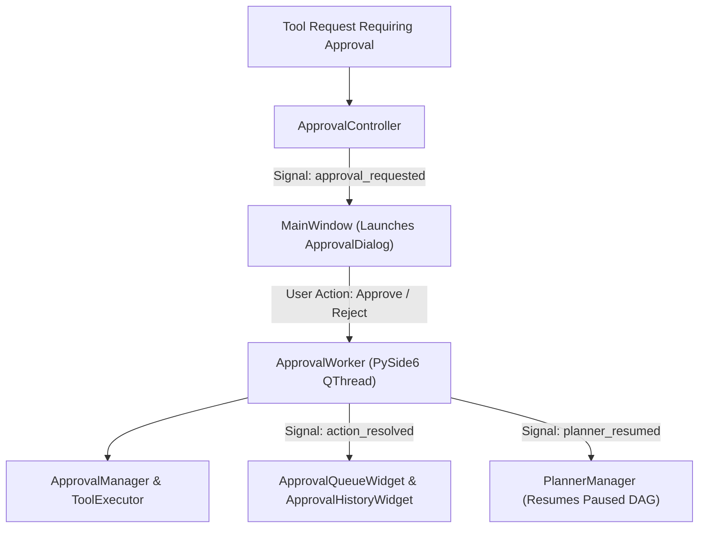

# Native Approval Center Specification (`app/gui/approval/`)

## Overview

The **Native Approval Center** (`app/gui/approval/`) replaces the CLI confirmation prompt with a graphical human-in-the-loop approval workflow integrated across all desktop views (Chat, Planner, Voice, Vision).

It consumes existing backend runtimes (`ApprovalManager`, `PendingAction`, `ToolExecutor`, `PlannerManager`, `ObservabilityManager`) via thread-safe `QThread` worker threads without altering or duplicating backend business logic.

---

## Subsystem Architecture & Threading Flow

---

## Component Responsibilities

1. **`risk.py` (`RiskBadgeWidget`)**: Color-coded security badge renderer displaying `SAFE` (emerald green), `CONFIRMATION` (amber yellow), and `RESTRICTED` (rose red).
2. **`queue.py` (`ApprovalQueueWidget`)**: Table presenting pending tool action approval requests, risk levels, requested arguments, and sources.
3. **`dialog.py` (`ApprovalDialog`)**: Modal popup approval dialog displaying action description, tool parameters, risk badge, and `Approve`/`Reject` buttons.
4. **`history.py` (`ApprovalHistoryWidget`)**: Historical log table recording approved and rejected tool requests with durations and statuses.
5. **`details.py` (`ApprovalDetailsWidget`)**: Inspector panel presenting tool parameters, risk factors, and provenance.
6. **`worker.py` (`ApprovalWorker`)**: PySide6 `QThread` resolving tool approvals, executing payloads, and resuming paused Planner tasks off-thread.
7. **`controller.py` (`ApprovalController`)**: Orchestrates approval queue operations, global signals, and history logging.

---

## Key Features

- **Modal Approval Dialog**: Intercepts tool execution requests requiring human permission across any view.
- **Dual Voice & GUI Synchronization**: When voice mode is active, Jarvis speaks approval requests while the GUI dialog pops up simultaneously.
- **Automatic Planner Resume**: Paused Autonomous Hierarchical Planner DAG nodes automatically resume execution upon approval.
