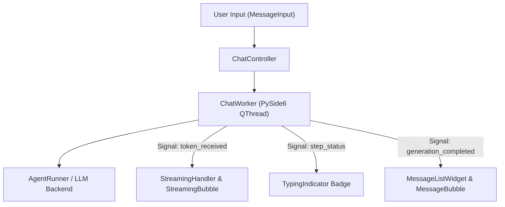

# Chat Interface & Streaming Experience Specification (`app/gui/chat/`)

## Overview

The **Chat Interface & Streaming Experience** (`app/gui/chat/`) provides a production-grade PySide6 conversation thread for Jarvis AI Assistant.

It consumes existing backend APIs (`AgentRunner`, `AgentController`, `ToolExecutor`, `MemoryManager`, `PlannerManager`, `KnowledgeManager`, `ObservabilityManager`) via thread-safe `QThread` workers without altering or duplicating backend business logic.

---

## Subsystem Architecture & Threading Flow

---

## Component Responsibilities

1. **`models.py`**: Domain models (`ChatMessage`, `MessageType`, `AttachmentInfo`, `ConversationSession`).
2. **`controller.py` (`ChatController`)**: Orchestrates active conversation session, message persistence, and QThread worker spawning.
3. **`worker.py` (`ChatWorker`)**: Off-thread `QThread` runner executing LLM generation off the UI thread and emitting PySide6 signals.
4. **`streaming.py` (`StreamingHandler`)**: Manages real-time updating of `StreamingBubble` as tokens arrive.
5. **`markdown.py` (`MarkdownRenderer`)**: Converts Markdown to PySide6 Rich Text HTML supporting headings, bold, italic, code, quotes, lists, and links.
6. **`syntax.py` (`CodeBlockWidget`)**: Monospace code container with language badges, copy button, and collapse controls.
7. **`citations.py` (`CitationWidget`)**: Expandable RAG document citation cards with clickable `file:///` URLs.
8. **`attachments.py` (`AttachmentWidget`, `AttachmentBar`)**: UI support for images, documents, clipboard pasting, and drag & drop file intake.
9. **`message.py`**: Custom message bubbles (`User`, `Assistant`, `Tool`, `Planner`, `Approval`, `Error`), `StreamingBubble`, `TypingIndicator`, and `MessageListWidget`.

---

## Keyboard Shortcuts & Input Controls

- **Enter**: Sends the typed message to Jarvis.
- **Shift + Enter**: Inserts a newline character without sending.
- **📎 Attachment Button**: Opens file browser to attach local images or documents.
- **🎙️ Voice Button**: Placeholder trigger for Phase 25.3 Voice interaction.
- **➕ New Chat**: Clears current thread and starts a fresh `ConversationSession`.
