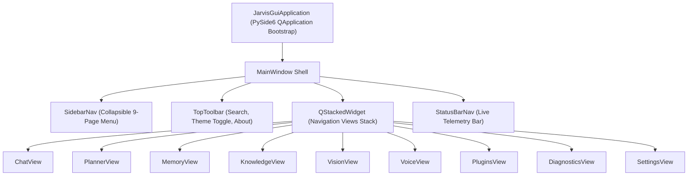

# Desktop GUI Foundation Specification (`app/gui/`)

## Overview

The **Desktop GUI Foundation** (`app/gui/`) provides a production-quality PySide6 desktop application shell for Jarvis AI Assistant.

The GUI layer consumes existing `Application`, `ObservabilityManager`, and `JarvisPluginSDK` backend APIs without duplicating or modifying core backend business logic.

---

## Subsystem Architecture & Navigation Stack

---

## Registered Application Pages

1. **Chat**: Full-duplex conversation thread with LLM streaming and tool execution cards.
2. **Planner**: Autonomous Hierarchical Planner DAG task graphs and node execution progress.
3. **Memory**: Fact, preference, and project memory management with evidence validation.
4. **Knowledge**: Personal Knowledge Base (RAG) document search, ingestion, and citations.
5. **Vision**: Local Vision Runtime screen capture, region selection, and OCR chart inspection.
6. **Voice**: Full-duplex voice interaction, wake word detection, and TTS speech synthesis controls.
7. **Plugins**: Plugin Manager catalog, permissions sandbox, and hot-reload management.
8. **Diagnostics**: Observability telemetry metrics, distributed tracing spans, and event timelines.
9. **Settings**: Model options, provider endpoints, theme preferences, and shortcuts.

---

## Theme System & Aesthetics (`theme.py`)

- **Dark Mode**: Curated HSL dark palette (`#12141c` background, `#1a1d29` card surface, `#242838` borders, `#6366f1` indigo accent).
- **Light Mode**: Curated HSL light palette (`#f8fafc` background, `#ffffff` card surface, `#e2e8f0` borders, `#4f46e5` indigo accent).
- **Glassmorphic Card Borders & Micro-Animations**: Smooth button hover state transitions (`#312e81` active highlight).

---

## Telemetry Status Bar (`status_bar.py`)

The bottom `StatusBarNav` displays live telemetry:
- `Model`: Current active model (`llama3`)
- `Provider`: Active LLM provider (`ollama`)
- `Active Session`: Current conversation session ID
- `Memory Count`: Indexed facts count
- `Plugin Count`: Loaded plugins count
- `System Status`: Live status indicator (`Ready`, `Busy`, `Degraded`)

---

## Settings Persistence (`settings.py`)

Persists application geometry and UI state via PySide6 `QSettings`:
- Window geometry and position
- Sidebar collapsed state (`true`/`false`)
- Last active page name (default `"chat"`)
- Active theme preference (`"dark"` / `"light"`)
