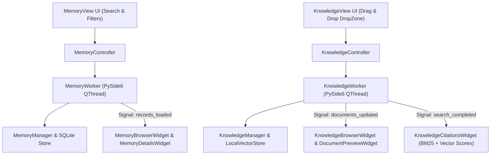

# Memory & Knowledge Center Specification (`app/gui/memory/`, `app/gui/knowledge/`)

## Overview

The **Memory & Knowledge Center** (`app/gui/memory/`, `app/gui/knowledge/`) provides production-quality PySide6 desktop views for multi-type long-term memory management and RAG Personal Knowledge Base ingestion and search.

It consumes existing backend runtimes (`MemoryManager`, `KnowledgeManager`, `ConversationManager`, `HybridRetriever`, `CitationFormatter`, `ObservabilityManager`) via thread-safe `QThread` worker threads without altering or duplicating backend business logic.

---

## Subsystem Architecture & Threading Flow

---

## Component Responsibilities

### Memory Subsystem (`app/gui/memory/`)
1. **`browser.py` (`MemoryBrowserWidget`)**: Table view displaying memory facts, preferences, project context, and creation timestamps.
2. **`details.py` (`MemoryDetailsWidget`)**: Inspector panel presenting content, memory type, importance score, source provenance, and metadata.
3. **`editor.py` (`MemoryEditorWidget`)**: Modal dialog for creating and editing memory records.
4. **`search.py` (`MemorySearchWidget`)**: Keyword search bar.
5. **`filters.py` (`MemoryFilterWidget`)**: Dropdown filters for memory type and importance.
6. **`worker.py` (`MemoryWorker`)**: PySide6 `QThread` performing memory queries and updates off-thread.
7. **`controller.py` (`MemoryController`)**: Orchestrates memory record operations.

### Knowledge Subsystem (`app/gui/knowledge/`)
1. **`ingestion.py` (`IngestionDropZoneWidget`)**: Drag & drop target and file picker for document ingestion into RAG vector store.
2. **`search.py` (`KnowledgeSearchWidget`)**: Hybrid vector + BM25 search bar.
3. **`citations.py` (`KnowledgeCitationsWidget`)**: RAG match card displaying composite score, BM25 score, vector similarity score, and text snippets.
4. **`preview.py` (`DocumentPreviewWidget`)**: Multi-format text previewer for Markdown, TXT, PDF, DOCX, and Code with chunk highlights.
5. **`browser.py` (`KnowledgeBrowserWidget`)**: Table view displaying indexed documents and chunk counts.
6. **`worker.py` (`KnowledgeWorker`)**: PySide6 `QThread` executing document parsing, chunking, embedding, and hybrid search off-thread.
7. **`controller.py` (`KnowledgeController`)**: Orchestrates document ingestion and hybrid search workflows.

---

## Controls & Features

- **➕ Add Fact**: Launches modal `MemoryEditorWidget` to persist new memory records.
- **📂 Drag & Drop Zone**: Ingests local documents and folders into the local vector store.
- **🔍 Hybrid Search**: Performs combined vector cosine similarity and BM25 text search across indexed knowledge.
- **🎯 Score Breakdowns**: Displays composite score, vector score, and BM25 score for all citations.
