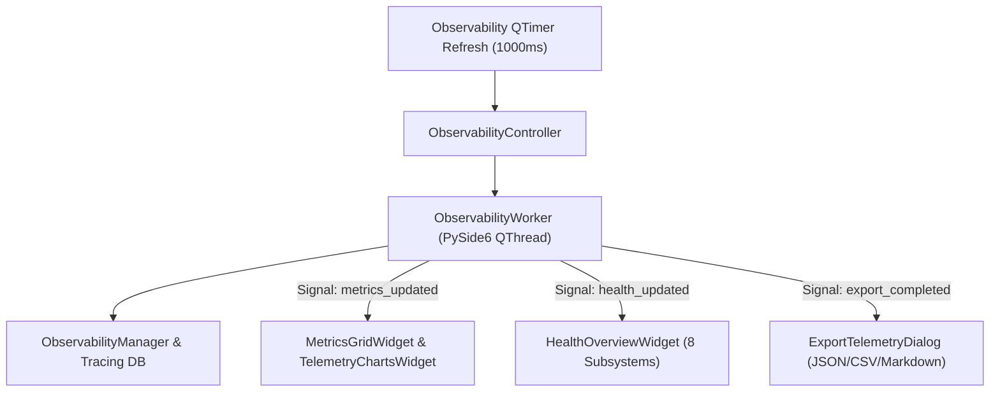

# Observability Dashboard Specification (`app/gui/observability/`)

## Overview

The **Observability Dashboard** (`app/gui/observability/`) provides a production-grade PySide6 developer console for real-time telemetry metrics, distributed tracing, request event timelines, subsystem health statuses, and export capabilities.

It consumes existing backend runtimes (`ObservabilityManager`, `RuntimeMetricsCollector`, `DistributedTracer`, `TimelineRecorder`, `HealthDashboardAPI`, `TelemetryExporter`) via thread-safe `QThread` worker threads without altering or duplicating backend business logic.

---

## Subsystem Architecture & Threading Flow

---

## Component Responsibilities

1. **`health.py` (`HealthOverviewWidget`)**: Health status grid displaying live badges (`HEALTHY`/`DEGRADED`/`DOWN`) for all 8 subsystems (Agent, LLM, Memory, Knowledge, Planner, Voice, Vision, Plugins).
2. **`metrics.py` (`MetricsGridWidget`)**: Telemetry counter cards displaying Tokens/sec, Average Latency, Active Requests, Queue Depth, RAM Usage, and CPU Load.
3. **`charts.py` (`TelemetryChartsWidget`)**: Animated QPainter trend curves for request latency and token throughput.
4. **`traces.py` (`TraceTreeWidget`)**: Distributed trace tree view presenting parent/child span operations, durations, and statuses.
5. **`timeline.py` (`TimelineViewWidget`)**: Chronological request event timeline across all subsystems.
6. **`requests.py` (`RequestDetailsWidget`)**: Inspector panel displaying request trace properties and span attributes.
7. **`export.py` (`ExportTelemetryDialog`)**: Modal dialog for exporting telemetry to JSON snapshots, CSV spreadsheets, and Markdown reports.
8. **`worker.py` (`ObservabilityWorker`)**: Off-thread `QThread` performing telemetry aggregation and report generation off the UI thread.
9. **`controller.py` (`ObservabilityController`)**: Manages QTimer auto-refresh loop and QThread worker lifecycle.

---

## Interactive Controls

- **🔄 Refresh**: Triggers immediate off-thread telemetry collection.
- **📥 Export Telemetry**: Opens modal `ExportTelemetryDialog` to export reports.
- **📈 Real-Time Charts**: Displays live trend curves updated every 500ms.
