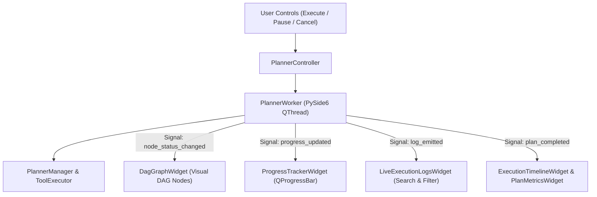

# Planner Dashboard Specification (`app/gui/planner/`)

## Overview

The **Planner Dashboard** (`app/gui/planner/`) provides a production-grade PySide6 graphical interface for the Autonomous Hierarchical Planning Engine.

It exposes real-time DAG task graph execution, dependency nodes, progress tracking, chronological execution timelines, self-correction recovery, live log streaming, and Observability metrics via thread-safe `QThread` workers without altering backend business logic.

---

## Subsystem Architecture & Threading Flow

---

## Component Responsibilities

1. **`graph.py` (`DagGraphWidget`)**: Renders visual DAG nodes with color-coded states (`Completed`=green, `Running`=indigo, `Failed`=red, `Waiting`=gray), dependency edges, and click inspector details.
2. **`timeline.py` (`ExecutionTimelineWidget`)**: Chronological step timeline list displaying `Planning`, `Tool`, `Verification`, `Recovery`, and `Completion` transitions.
3. **`progress.py` (`ProgressTrackerWidget`)**: Progress bar, task metrics ratio, running task name, and `Pause`, `Resume`, `Cancel` control buttons.
4. **`recovery.py` (`RecoveryPanelWidget`)**: Retry history, recovery strategy evaluation, and state rollback status.
5. **`execution.py` (`LiveExecutionLogsWidget`)**: Real-time log stream panel with search filter and clear controls.
6. **`widgets.py` (`PlanMetricsWidget`, `PlanCardWidget`)**: Exposes live Observability metrics (`Active Plans`, `Completed Today`, `Success Rate`, `Recovery Rate`, `Avg Duration`).
7. **`worker.py` (`PlannerWorker`)**: Off-thread `QThread` executing plan steps and emitting PySide6 UI signals.
8. **`controller.py` (`PlannerController`)**: Orchestrates plan execution lifecycle and node status transitions.

---

## Interactive Controls

- **➕ Create Plan**: Triggers plan synthesis workflow.
- **▶️ Execute Plan**: Spawns `PlannerWorker` QThread for execution.
- **⏸️ Pause / ▶️ Resume**: Pauses or resumes active plan step execution.
- **⏹️ Cancel**: Gracefully terminates active plan worker.
- **📥 Export DAG**: Exports plan structure to JSON or Markdown.
