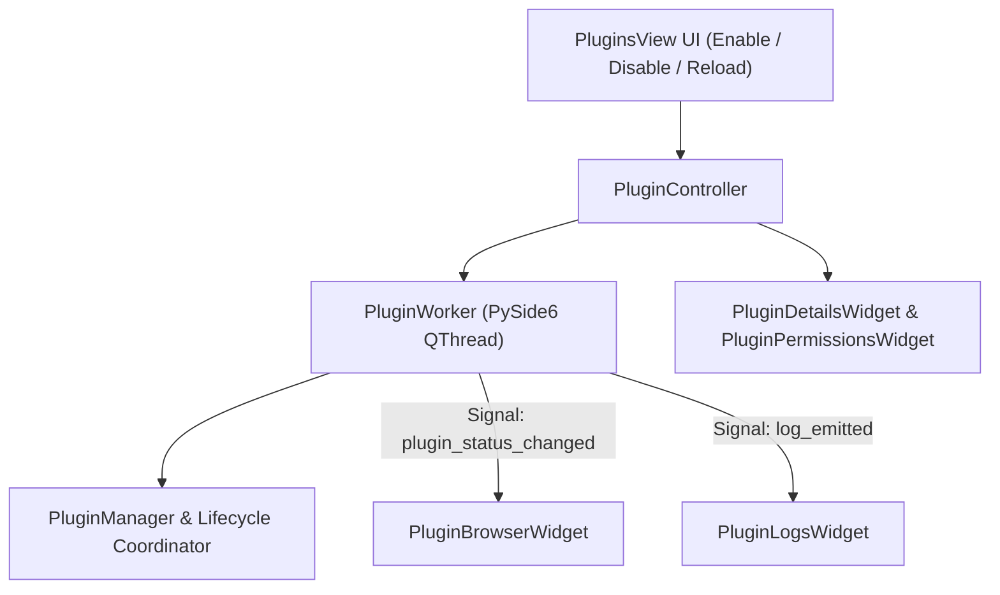

# Plugin Manager Specification (`app/gui/plugins/`)

## Overview

The **Plugin Manager Workspace** (`app/gui/plugins/`) provides a production-quality PySide6 desktop interface for managing Jarvis extensions, permission sandboxing, hot-reloading, and online marketplace discovery.

It consumes existing backend runtimes (`PluginManager`, `PluginRegistry`, `PluginLifecycleCoordinator`, `PluginEventBus`, `ObservabilityManager`) via thread-safe `QThread` worker threads without altering or duplicating backend business logic.

---

## Subsystem Architecture & Threading Flow

---

## Component Responsibilities

1. **`browser.py` (`PluginBrowserWidget`)**: Table presenting installed plugins, versions, authors, health status (`Healthy`/`Degraded`), startup times, and quick action buttons (`Enable`, `Disable`, `Reload`).
2. **`details.py` (`PluginDetailsWidget`)**: Inspector panel displaying plugin manifest details, capabilities, registered tools, voice commands, and planner hooks.
3. **`permissions.py` (`PluginPermissionsWidget`)**: Declared permission viewer displaying color-coded security risk tags (`Filesystem`, `Network`, `Vision`, `Voice`, `Memory`).
4. **`marketplace.py` (`PluginMarketplaceWidget`)**: Online marketplace catalog cards preparing for future online extension discovery and installation.
5. **`logs.py` (`PluginLogsWidget`)**: Real-time log stream panel presenting plugin lifecycle events and health check traces.
6. **`worker.py` (`PluginWorker`)**: PySide6 `QThread` performing plugin loading, enabling, disabling, hot-reloading, and health checks off-thread.
7. **`controller.py` (`PluginController`)**: Orchestrates plugin action execution and state updates.

---

## Interactive Controls

- **🔄 Hot-Reload All**: Dynamically reloads all active plugin modules without restarting the desktop application.
- **🏥 Health Check**: Triggers system-wide diagnostic checks across all registered plugin extensions.
- **🔒 Security Risk Badges**: Highlights high-risk permissions (`Filesystem` in red, `Network` in red, `Vision/Voice` in indigo).
