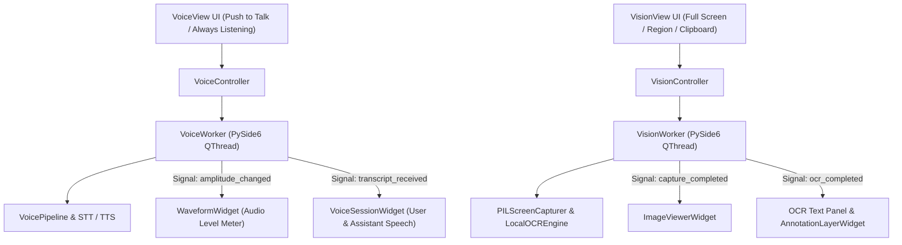

# Voice & Vision Workspace Specification (`app/gui/voice/`, `app/gui/vision/`)

## Overview

The **Voice & Vision Workspace** (`app/gui/voice/`, `app/gui/vision/`) provides production-quality PySide6 desktop views for voice interaction, desktop screen grabs, region cropping, and OCR inspection.

It consumes existing backend runtimes (`VoicePipeline`, `VisionPipeline`, `PlaybackManager`, `WakeWordDetector`, `LocalOCREngine`, `PILScreenCapturer`, `ObservabilityManager`) via thread-safe `QThread` worker threads without altering or duplicating backend business logic.

---

## Subsystem Architecture & Threading Flow

---

## Component Responsibilities

### Voice Subsystem (`app/gui/voice/`)
1. **`waveform.py` (`WaveformWidget`)**: Dynamic animated audio level meter displaying microphone volume bars.
2. **`microphone.py` (`MicrophoneDeviceSelector`)**: Audio input device selection dropdown.
3. **`session.py` (`VoiceSessionWidget`)**: Displays wake-word status ("Jarvis"), user spoken transcript, assistant speech output, and barge-in interrupt button.
4. **`worker.py` (`VoiceWorker`)**: PySide6 `QThread` running STT transcription and TTS speech playback off-thread.
5. **`controller.py` (`VoiceController`)**: Orchestrates voice session state, push-to-talk, and barge-in requests.

### Vision Subsystem (`app/gui/vision/`)
1. **`overlays.py` (`RegionSelectionOverlay`)**: Semi-transparent full-screen bounding box selector for screen region cropping.
2. **`annotations.py` (`AnnotationLayerWidget`)**: Bounding box overlay for OCR text and visual detection highlights.
3. **`viewer.py` (`ImageViewerWidget`)**: Interactive image viewer canvas supporting preview zoom and pan.
4. **`worker.py` (`VisionWorker`)**: PySide6 `QThread` executing screen capture, active window grab, clipboard intake, and OCR extraction off-thread.
5. **`controller.py` (`VisionController`)**: Orchestrates capture workflows and recent capture history.

---

## Workspace Controls & Features

- **🎤 Push to Talk**: Triggers immediate audio capture and STT transcription.
- **🔄 Always-Listening Toggle**: Toggles continuous wake-word detection.
- **🛑 Interrupt (Barge-in)**: Immediately halts active assistant speech playback.
- **🖥️ Full Screen**: Captures entire desktop display.
- **🪟 Active Window**: Captures currently focused application window.
- **📐 Capture Region**: Launches semi-transparent bounding box picker overlay.
- **📋 Clipboard Image**: Imports image directly from system clipboard.
