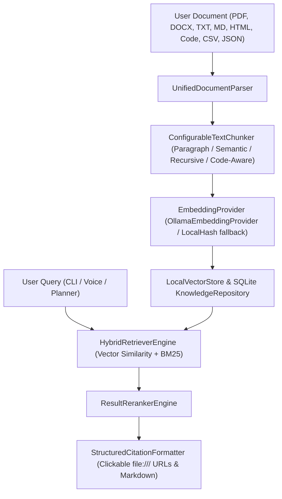

# Personal Knowledge Base (RAG) Subsystem Specification (`app/knowledge/`)

## Overview

The **Personal Knowledge Base (RAG) Subsystem** (`app/knowledge/`) provides Jarvis with local document ingestion, multi-strategy chunking, vector embedding generation, local vector indexing, hybrid retrieval (vector similarity + BM25 keyword matching), cross-feature reranking, and structured citations.

The Knowledge Base complements long-term memory while maintaining strict memory isolation (retrieved document chunks are **never** automatically persisted to long-term memory).

---

## Ingestion & Query Flow

---

## Package Component Responsibilities

1. **`models.py`**: Immutable domain models (`Document`, `DocumentChunk`, `KnowledgeQuery`, `RetrievalResult`, `Citation`, `IndexStatus`).
2. **`interfaces.py`**: Abstract interface contracts (`DocumentParser`, `TextChunker`, `EmbeddingProvider`, `VectorStore`, `HybridRetriever`, `ResultReranker`, `CitationFormatter`).
3. **`parser.py` (`UnifiedDocumentParser`)**: Extensible parser for PDF, DOCX, TXT, MD, HTML, JSON, CSV, Code files, and Git repositories.
4. **`chunker.py` (`ConfigurableTextChunker`)**: Multi-strategy chunking (`PARAGRAPH`, `SEMANTIC`, `RECURSIVE`, `CODE_AWARE`).
5. **`embeddings.py`**: `OllamaEmbeddingProvider` and deterministic offline `LocalHashEmbeddingProvider`.
6. **`index.py` (`LocalVectorStore`)**: Cosine similarity vector search, metadata filtering, and index management.
7. **`repository.py` (`SQLiteKnowledgeRepository`)**: SQLite persistence for documents, chunks, and embeddings in `data/jarvis.db`.
8. **`retriever.py` (`HybridRetrieverEngine`)**: Merges vector similarity scores and BM25 keyword matching scores with configurable `alpha` ratio.
9. **`reranker.py` (`ResultRerankerEngine`)**: Re-scores candidate matches for exact phrase alignment and document diversity.
10. **`citations.py` (`StructuredCitationFormatter`)**: Generates structured citations with clickable `file:///` URLs.
11. **`ingestion.py` (`IngestionPipeline`)**: Intake -> Parse -> Chunk -> Embed -> Vector Indexing.
12. **`manager.py` (`KnowledgeManager`)**: Subsystem coordinator and telemetry manager.

---

## Built-in System Tools (`app/tools/builtin/knowledge.py`)

| Tool Name | Permission | Description |
| :--- | :--- | :--- |
| `ingest_document` | `SAFE` | Parses, chunks, embeds, and indexes a file or directory path. |
| `search_knowledge` | `SAFE` | Performs hybrid vector/keyword search with structured citations. |
| `summarize_document` | `SAFE` | Generates a summary of an ingested document. |
| `list_documents` | `SAFE` | Lists all indexed documents and metadata in the RAG Knowledge Base. |
| `remove_document` | `SAFE` | Removes an ingested document and its vector embeddings. |

---

## Subsystem Integrations & Memory Isolation

- **Planner**: Incorporates RAG search tools (`search_knowledge`, `summarize_document`) into DAG task plans.
- **Memory Isolation**: Retrieved document chunks are **never** saved to long-term memory automatically.
- **Voice**: Spoken voice queries speak answers aloud via TTS while preserving citations in text output.
- **Vision**: OCR-extracted document screenshots can be ingested into the Knowledge Base after user confirmation.
