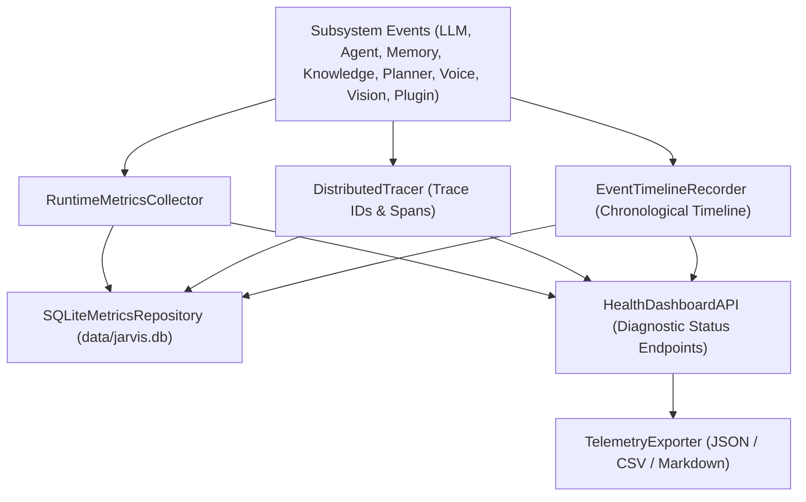

# Observability & Developer Console Subsystem Specification (`app/observability/`)

## Overview

The **Observability & Developer Console Subsystem** (`app/observability/`) collects live runtime telemetry, distributed tracing spans, and chronological request event timelines across every major subsystem of Jarvis without altering their underlying business logic.

This subsystem provides clean programmatic status APIs (`HealthDashboardAPI`), diagnostic exports (JSON, CSV, Markdown), and SQLite persistence to power Phase 25 Desktop GUI diagnostic panels.

---

## Subsystem Architecture & Telemetry Pipeline



---

## Metric Collection Categories Across 8 Subsystems

1. **LLM**: `requests`, `latency`, `tokens`, `tokens_per_sec`, `streaming_duration`, `scheduler_wait_time`.
2. **Agent**: `iterations`, `routing_decisions`, `tool_calls`, `approvals`, `failures`.
3. **Memory**: `retrieval_count`, `extraction_count`, `persistence`, `duplicates`, `conflicts`.
4. **Knowledge**: `documents`, `chunks`, `searches`, `retrieval_latency`.
5. **Planner**: `active_plans`, `completed_plans`, `failed_plans`, `recovery_attempts`.
6. **Voice**: `transcription_latency`, `synthesis_latency`, `interruptions`, `wake_detections`.
7. **Vision**: `ocr_duration`, `image_analysis_duration`, `capture_latency`.
8. **Plugin Runtime**: `active_plugins`, `failed_plugins`, `reloads`, `event_counts`.

---

## Distributed Tracing & Span Hierarchy

Every user request or goal task is tagged with a unique `trace_id`. Subsystem operations open parent/child `Span` instances:

```json
{
  "trace_id": "trace_a1b2c3d4e5f6",
  "span_id": "span_f1e2d3c4",
  "parent_span_id": null,
  "subsystem": "agent",
  "name": "agent_turn",
  "start_time": "2026-08-05T02:15:00.000Z",
  "end_time": "2026-08-05T02:15:00.050Z",
  "duration_ms": 50.2,
  "status": "OK",
  "attributes": {"iteration": 1}
}
```

---

## Built-in System Tools (`app/tools/builtin/observability.py`)

| Tool Name | Permission | Description |
| :--- | :--- | :--- |
| `get_health_report` | `SAFE` | Returns overall system health report and subsystem statuses. |
| `get_runtime_telemetry` | `SAFE` | Returns live metrics counters and latencies across all 8 subsystems. |
| `export_telemetry` | `SAFE` | Exports system telemetry to JSON, CSV, or Markdown file. |

---

## Health Dashboard API for Desktop GUI Integration (`dashboard.py`)

- `health_report()`: Returns overall health (`ok`, `degraded`, `error`), subsystem statuses, active request count, and uptime seconds.
- `system_metrics()`: Returns live aggregated metrics dictionary.
- `runtime_summary()`: Snapshot summary of metrics, active trace counts, and timeline lengths.
- `active_requests()`: Returns active in-flight tracing spans.
- `queue_depth()`: Returns active trace queue depth metrics.
- `plugin_status()`, `voice_status()`, `vision_status()`, `planner_status()`, `knowledge_status()`: Individual subsystem health statuses.
