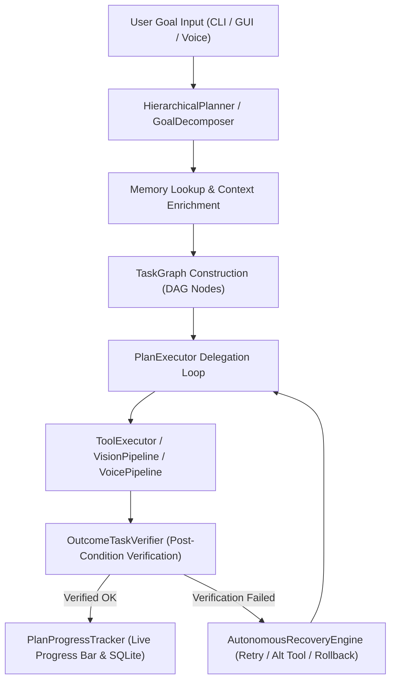

# Autonomous Hierarchical Planning Engine Specification (`app/planner/`)

## Overview

The **Autonomous Hierarchical Planning Engine** (`app/planner/`) enables Jarvis to decompose complex user goals into executable Directed Acyclic Graphs (DAGs) of task nodes, execute them via the existing runtime, verify step outcomes, recover from step failures, track live progress, and persist plan state in SQLite.

The planner never duplicates execution logic. It decides *what* to do; the existing `AgentRunner`, `ToolExecutor`, `VisionPipeline`, `VoicePipeline`, `MemoryManager`, and `ApprovalManager` execute *how* to do it.

---

## Architecture Diagram

---

## Package Component Responsibilities

1. **`models.py`**: Immutable domain models (`Goal`, `Plan`, `PlanNode`, `ExecutionStep`, `VerificationResult`, `RecoveryAction`, `PlanStatus`, `NodeStatus`, `NodeType`, `PlanProgress`).
2. **`interfaces.py`**: Abstract interface contracts (`HierarchicalPlanner`, `TaskGraphExecutor`, `TaskVerifier`, `RecoveryEngine`, `PlanRepository`).
3. **`graph.py` (`TaskGraph`)**: DAG structure management, cycle detection, topological dependency sorting, and readiness evaluation.
4. **`planner.py` (`GoalDecomposer`)**: Goal decomposition into verified task nodes.
5. **`executor.py` (`PlanExecutor`)**: Plan execution loop delegating steps to runtime subsystems.
6. **`verifier.py` (`OutcomeTaskVerifier`)**: Post-condition verification (path inspection, process detection).
7. **`recovery.py` (`AutonomousRecoveryEngine`)**: Retry strategies, alternative tool switching, rollbacks, or user prompt escalation.
8. **`scheduler.py` (`TaskScheduler`)**: Ready node queueing and concurrency scheduling.
9. **`progress.py` (`PlanProgressTracker`)**: Percentage completion, progress bar rendering (`Task 4/12 [███████░░░░] 58%`), and event callbacks.
10. **`repository.py` (`SQLitePlanRepository`)**: SQLite persistence for plans, nodes, and execution logs in `data/jarvis.db`.
11. **`manager.py` (`PlannerManager`)**: Subsystem coordinator and metrics tracker.

---

## Built-in System Tools (`app/tools/builtin/planner.py`)

| Tool Name | Permission | Description |
| :--- | :--- | :--- |
| `decompose_goal` | `SAFE` | Decomposes a goal into an ordered DAG task plan. |
| `execute_plan` | `SAFE` | Executes an existing DAG task plan by `plan_id`. |
| `get_plan_status` | `SAFE` | Retrieves live completion percentage, progress bar, and node status. |
| `control_plan` | `SAFE` | Pauses, resumes, or cancels a plan. |

---

## Long-Running Plan Operations

Plans support pause, resume, cancellation, and restart across application sessions via SQLite persistence in `data/jarvis.db`:
- `pause_plan(plan_id)`
- `resume_plan(plan_id)`
- `cancel_plan(plan_id)`

---

## Voice & Vision Subsystem Integration

- **Voice**: Spoken goals trigger plan explanations and TTS progress updates (`VoicePipeline.speak`).
- **Vision**: Vision observation nodes (`capture_screen`, `read_dialog`) are inserted into the DAG graph when visual desktop inspection is needed.
- **Approval**: Approval nodes reuse `ApprovalManager` and never bypass confirmation-required tools.
