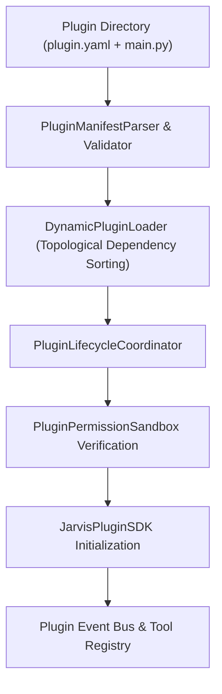

# Provider-Neutral Plugin SDK & Extension Framework (`app/plugins/`)

## Overview

The **Plugin SDK & Extension Framework** (`app/plugins/`) enables developers to build custom tools, voice commands, event listeners, and task hooks for Jarvis without modifying core system code.

Plugins are sandboxed and communicate exclusively via the restricted `JarvisPluginSDK` facade. Direct access to `ServiceContainer` or core internal objects is strictly prohibited.

---

## Architecture & Lifecycle



### Lifecycle Flow
1. **Discovery**: `DynamicPluginLoader` scans `plugins/` for valid `plugin.yaml` / `plugin.json` manifests.
2. **Validation**: Manifest fields (`id`, `name`, `version`, `entrypoint`, `permissions`) are parsed and checked.
3. **Dependency Resolution**: Manifests are sorted topologically. Unresolved or circular dependencies log warnings gracefully without halting initialization.
4. **Fault-Isolated Loading**: Dynamic module loading instantiates each plugin class. If a single plugin fails, remaining plugins continue loading cleanly.
5. **Registration Hooks**: Initializes capability facades (`sdk.tools`, `sdk.memory`, `sdk.voice`, `sdk.vision`, `sdk.knowledge`, `sdk.planner`, `sdk.events`).
6. **Hot Reloading**: Active plugins can be reloaded at runtime via `reload_plugin(plugin_id)` without restarting Jarvis.

---

## Plugin Manifest Specification (`plugin.yaml` / `plugin.json`)

```yaml
id: calculator
name: Calculator Plugin
version: 1.0.0
author: Jarvis Team
description: Safe arithmetic calculation tool plugin.
entrypoint: main.py:CalculatorPlugin
permissions:
  - confirmation
dependencies: []
tools:
  - calculate_expression
```

### Supported Permissions (`PluginPermission`)
- `filesystem`: Grants local file reading/writing capability.
- `desktop`: Grants desktop backend interaction.
- `voice`: Grants TTS voice output and audio intake.
- `vision`: Grants screen capture and OCR analysis.
- `knowledge`: Grants RAG Knowledge Base search and ingestion.
- `planner`: Grants goal submission to the Hierarchical Planner Engine.
- `network`: Grants HTTP/API access.
- `memory`: Grants long-term memory lookup and candidate storage.
- `confirmation`: Grants user approval triggers.

---

## Creating a Custom Plugin: Step-by-Step

### Step 1: Create Plugin Directory
Create `plugins/my_custom_plugin/plugin.yaml`:
```yaml
id: my_custom_plugin
name: My Custom Plugin
version: 1.0.0
author: Developer Name
description: Example custom plugin.
entrypoint: main.py:MyPlugin
permissions:
  - confirmation
```

### Step 2: Implement `Plugin` Base Class
Create `plugins/my_custom_plugin/main.py`:
```python
from app.plugins.interfaces import Plugin
from app.plugins.sdk import JarvisPluginSDK
from app.plugins.models import PluginEvent

class MyPlugin(Plugin):
    def initialize(self, sdk: JarvisPluginSDK) -> None:
        self.sdk = sdk
        sdk.logger.info("MyPlugin initialized!")

    def shutdown(self) -> None:
        self.sdk.logger.info("MyPlugin shutting down!")

    def register_events(self, sdk: JarvisPluginSDK) -> None:
        sdk.events.subscribe("assistant_started", self.on_started)

    def on_started(self, event: PluginEvent) -> None:
        self.sdk.logger.info("Received assistant_started event!")
```

---

## Built-in System Tools (`app/tools/builtin/plugin.py`)

| Tool Name | Permission | Description |
| :--- | :--- | :--- |
| `list_plugins` | `SAFE` | Lists installed plugins, versions, status, and permissions. |
| `enable_plugin` | `SAFE` | Enables an installed plugin by `plugin_id`. |
| `disable_plugin` | `SAFE` | Disables an active plugin by `plugin_id`. |
| `reload_plugin` | `SAFE` | Hot-reloads an active plugin at runtime without restarting Jarvis. |

---

## Example Plugins Included (`plugins/examples/`)

1. **`hello_world`**: Demonstrates greeting tool registration and `assistant_started` event subscription.
2. **`calculator`**: Demonstrates safe arithmetic expression evaluation tool registration.
3. **`system_monitor`**: Demonstrates CPU/RAM memory telemetry tool registration via `psutil`.
4. **`weather_mock`**: Demonstrates mock weather forecast tool registration.
