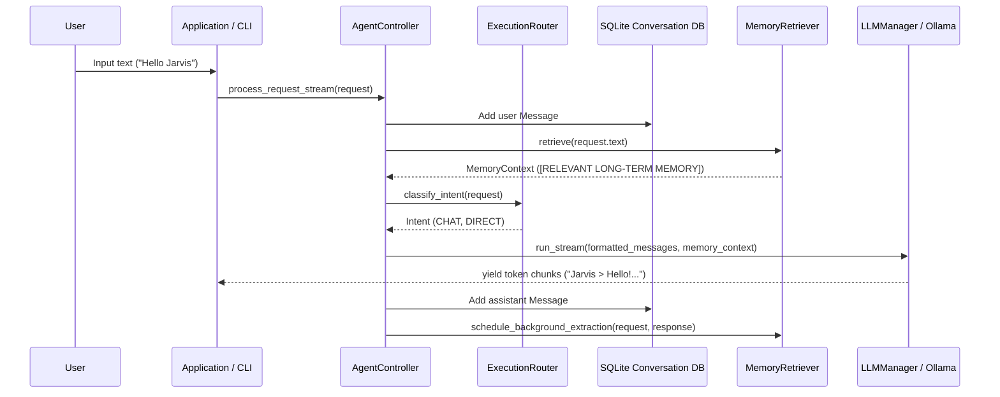
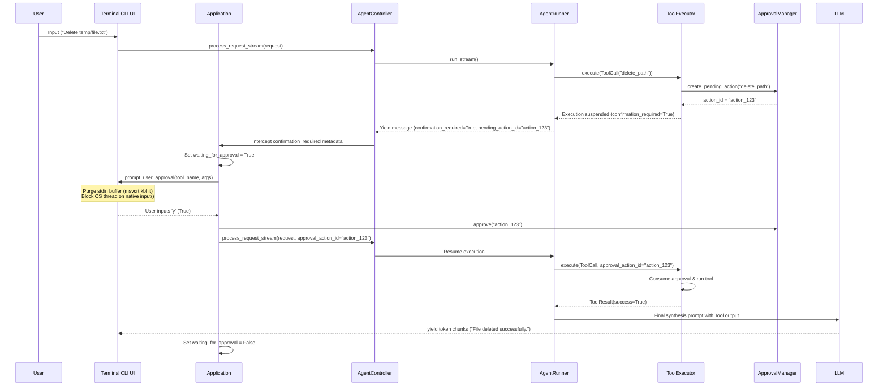
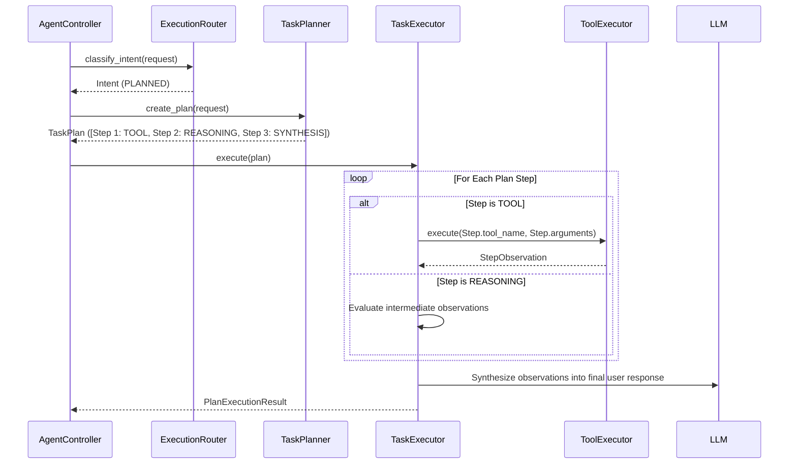

# Request Processing Flow

This document details the step-by-step lifecycle of user requests in the Jarvis AI Assistant across all processing modes (Direct Chat, Tool Execution with Blocking Action Approval, Multi-step Task Planning, Memory Retrieval, Voice Input, and Desktop GUI).

---

## 1. Direct Chat Request Flow



---

## 2. Tool Execution & Synchronized Blocking Action Approval Flow

When a request requires executing a tool marked with `ToolPermission.CONFIRMATION` (e.g. `delete_path`, `write_text_file`, `launch_application`, `focus_window`, `type_text`):



---

## 3. Multi-Step Task Planner Execution Flow

For complex tasks requiring multiple steps (e.g. "Find running process chrome, inspect disk usage, and write summary to log.txt"):



---

## 4. Persistent Memory Retrieval & Background Extraction Flow

1. **Foreground Retrieval Phase**:
   - Before building system prompts, `LexicalMemoryRetriever` queries the SQLite database for stored user facts and preferences matching key tokens in the user request.
   - Matched items are formatted by `MemoryContextBuilder` into a structured prompt section:
     ```markdown
     [RELEVANT LONG-TERM MEMORY]
     - User prefers dark mode.
     - User workspace directory is C:\Projects.
     ```
   - System prompt token budget is preserved.

2. **Background Extraction Phase**:
   - Immediately after the assistant response is delivered to the user, `AgentController` schedules an asynchronous extraction task.
   - `MemoryWriteCoordinator` runs `LLMMemoryExtractor` on a dedicated background worker thread (`InferencePriority.BACKGROUND`).
   - `MemoryEvidenceValidator` verifies that extracted memory candidates match verbatim text evidence from the user prompt.
   - Validated items are saved to the `memories` table in SQLite (`data/jarvis.db`).

---

## 5. Offline Voice Push-to-Talk Interaction Flow

1. **Trigger**: User presses hotkey or spacebar in Voice Mode.
2. **Audio Capture**: `AudioCapture` records microphone input into 16kHz PCM audio frames.
3. **Speech Activity Detection**: `VoiceActivityDetector` isolates voice segments using RMS energy boundaries.
4. **Offline Speech-to-Text**: `FasterWhisperSTTProvider` transcribes audio locally (using GPU CUDA or automatic CPU fallback).
5. **Air-Gapped Safety Check**: If the transcribed command requests a confirmation-level tool (e.g. "delete directory"), execution is suspended to `WAITING_APPROVAL`, speech output announces the required approval, and execution blocks until explicit terminal approval is granted. Spoken commands cannot bypass tool approvals.
6. **Speech Synthesis**: `PyTTSx3TTSProvider` strips markdown formatting and speaks the final assistant response.

---

## 6. Desktop GUI Event & Synchronization Flow

1. **User Action**: User types prompt or selects session in PySide6 `AppWindow`.
2. **Background Execution**: `AgentWorker` background `QThread` receives `AgentRequest` and runs `AgentController.process_request_stream()`.
3. **Signal Emission**:
   - `chunk_received(str)`: Emitted per token chunk to update `ChatWidget` live text view.
   - `approval_requested(action_id, tool_name, reason)`: Emitted when execution is suspended for confirmation, injecting an `ApprovalCardWidget` into the chat pane.
   - `response_completed(Message)`: Emitted when turn finishes, updating sidebar database metrics and history lists.
